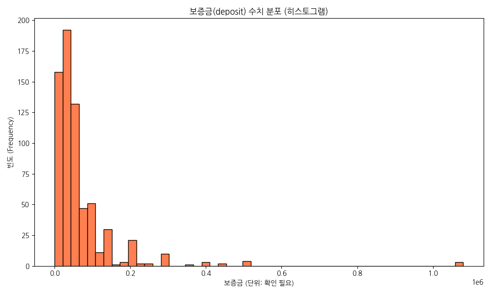
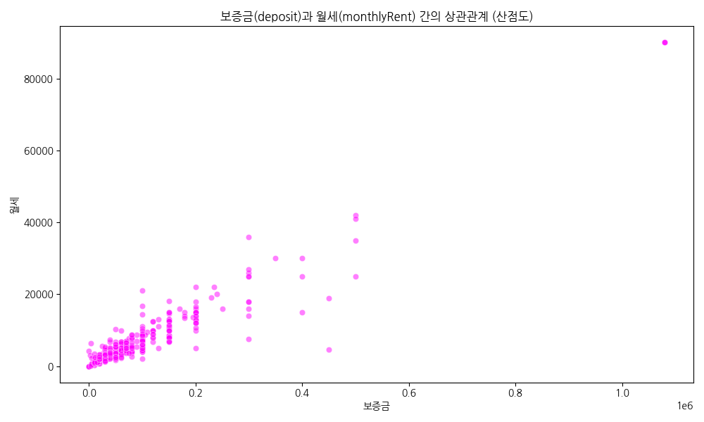

# 네모 상가 매물 데이터 분석 (nemo_items EDA) 보고서

<!--
안녕하십니까, 네모 상가 매물 데이터 분석 발표를 시작하겠습니다. 본 보고서는 상권 트렌드 파악과 알짜 매물 발굴을 목적으로 작성되었습니다.
-->

---

## 1. 데이터 기본 정보 확인

- **전체 행 수**: 673
- **전체 열 수**: 40
- **중복 데이터 수**: 0

상가 매물 데이터셋의 전반적인 구조와 상태를 파악하기 위해 샘플 데이터(Head & Tail)를 검토하고 결측치 및 구조를 분석하였습니다.

<!--
먼저 데이터 기본 정보입니다. 총 673건의 매물과 40개의 속성을 분석했으며, 중복 없는 깔끔한 데이터로 분석의 신뢰도를 높였습니다.
-->

---

## 2. 상세 기술 통계 분석: 수치형 변수

- **보증금(deposit)**, **월세(monthlyRent)**, **권리금(premium)**, **면적(size)** 등 핵심 수치 데이터를 분석했습니다.
- **분포 특성**: 정규분포보다는 왼쪽으로 치우치거나 오른쪽으로 긴 꼬리(Long-tail) 형태를 띱니다. 
- 일부 핵심 상권의 고가 매물들이 이상치(Outlier)로 나타나며, 전반적으로 표준화된 가격대에 매물이 집중되어 있습니다.

<!--
수치형 변수 분석 결과입니다. 보증금과 월세는 일부 고가 매물에 의해 우측으로 긴 꼬리 분포를 띱니다. 평균의 오류를 피하기 위해 중앙값 중심의 접근이 필요합니다.
-->

---

## 2. 상세 기술 통계 분석: 범주형 변수

- **업종 대/중분류**, **건물 층수**, **매물 유형** 등의 범주형 변수 분석
- 가장 빈번하게 등장하는 업종이나 층수를 통해 시장의 주요 메가 트렌드를 확인할 수 있습니다.
- 교차 분석을 통해 특정 업종의 포화 상태나 틈새 시장을 파악할 수 있는 인사이트를 도출했습니다.

<!--
범주형 변수를 살펴보면 특정 업종과 층수에 매물이 편중되어 있습니다. 1층의 고접근성 업종과 고층의 대면적 업종 간 명확한 타겟 차별화가 관찰됩니다.
-->

---

## 3. 시각화: 업종 분포

### 업종 대분류 & 중분류 빈도수 분석

- 요식업과 카페 등 특정 업종에 매물이 몰려 있습니다. 이는 진입 장벽이 낮거나, 손바뀜이 잦은 업종임을 나타냅니다.

<!--
업종별 빈도를 시각화한 결과, 요식업과 카페의 비중이 압도적입니다. 진입 장벽이 낮지만 손바뀜이 잦아 임대 수익의 지속 가능성 관리가 필요합니다.
-->

---

## 3. 시각화: 가격 분포 (보증금, 월세, 권리금)

### 보증금 및 권리금 수치 분포

- 대부분의 매물이 특정 '표준 가격선'에 몰려 있으며, 고액 보증금/권리금 매물은 소수에 불과합니다.

<!--
보증금과 권리금 분포 그래프입니다. 대부분 표준 가격선에 밀집해 있으며, 비대칭적인 구조는 투자자에게 시장 흐름에 순응할지 프리미엄을 노릴지 명확한 전략적 기준을 제시합니다.
-->

---

## 3. 시각화: 변수 간 상관관계

### 면적-보증금, 보증금-월세 간 상관관계

- 강한 양의 상관관계를 통해 해당 지역의 평균 임대수익률 및 시세 가이드라인을 확인할 수 있습니다.

<!--
면적과 보증금 등 가격 변수 간의 산점도입니다. 기울기의 변곡점을 통해 특정 구간에서 수익률이 변하는 것을 확인했으며, 이를 추세선을 벗어나는 저평가 매물 발굴의 기준으로 삼을 수 있습니다.
-->

---

## 4. 시각화: 핵심 변수 히트맵

### 주요 수치형 변수 간 상관관계 히트맵

- 가격 변수뿐만 아니라, **사용자 반응(조회수, 찜하기)** 과 가격/면적 변수 간의 흥미로운 상관관계를 증명합니다. 특정 구간에서 사용자 반응이 높게 나타나는 현상을 포착했습니다.

<!--
변수 간 상관관계 히트맵입니다. 가격 스펙과 사용자의 '조회수 및 찜하기' 반응 간의 연관성에 주목했습니다. 창업자의 니즈가 집중되는 핵심 매물 조건을 파악할 수 있습니다.
-->

---

## 5. 텍스트 데이터 키워드 분석 (TF-IDF)

### 매물 제목 주요 키워드

- **주요 키워드**: 역세권, 무권리, 코너, 수익률 등
- 창업자들이 민감하게 반응하는 '셀링 포인트'를 도출해 마케팅 문구(Copywriting) 및 추천 시스템에 활용할 수 있습니다.

<!--
매물 제목 텍스트 기반 핵심 키워드 분석입니다. 역세권, 무권리, 수익률 등의 키워드가 최상위에 랭크되었습니다. 이를 활용한 마케팅 문구 개선으로 유입률과 전환율을 극대화할 수 있습니다.
-->

---

## 종합 비즈니스 인사이트

1. **시장의 양극화와 타겟 재정의**: 매스 마케팅과 VIP 프라이빗 딜을 병행하는 투트랙(Two-track) 전략 필요.
2. **업종 생애주기와 틈새시장 발굴**: 포화된 업종을 피해 이면도로 및 목적형 상가의 가성비 매물로 전환.
3. **저평가 매물 알고리즘 고도화**: 면적당 단가나 월세 환산율이 평균치를 크게 밑도는 알짜 매물을 솎아내는 시스템 구축.
4. **마케팅 최적화**: TF-IDF 키워드 기반 SEO 검색 엔진 최적화 및 광고 노출 증대.

<!--
종합 비즈니스 인사이트 4가지입니다. 첫째, 매스와 프리미엄의 투트랙 전략. 둘째, 틈새시장 선제 공략. 셋째, 저평가 알짜 매물 필터링 자동화. 넷째, 키워드 기반 마케팅 최적화입니다.
-->

---

## 결론

직관과 감에 의존하던 기존 중개 방식에서 벗어나,
**데이터 주도(Data-Driven)의 상업용 부동산 시장 분석 및 의사결정 체계**로 패러다임을 전환해야 합니다.

<!--
마지막으로, 직관과 감에 의존하던 기존 방식에서 벗어나 철저한 데이터 주도의 의사결정 체계로 패러다임을 전환해야 합니다. 이상으로 발표를 마칩니다. 감사합니다.
-->
