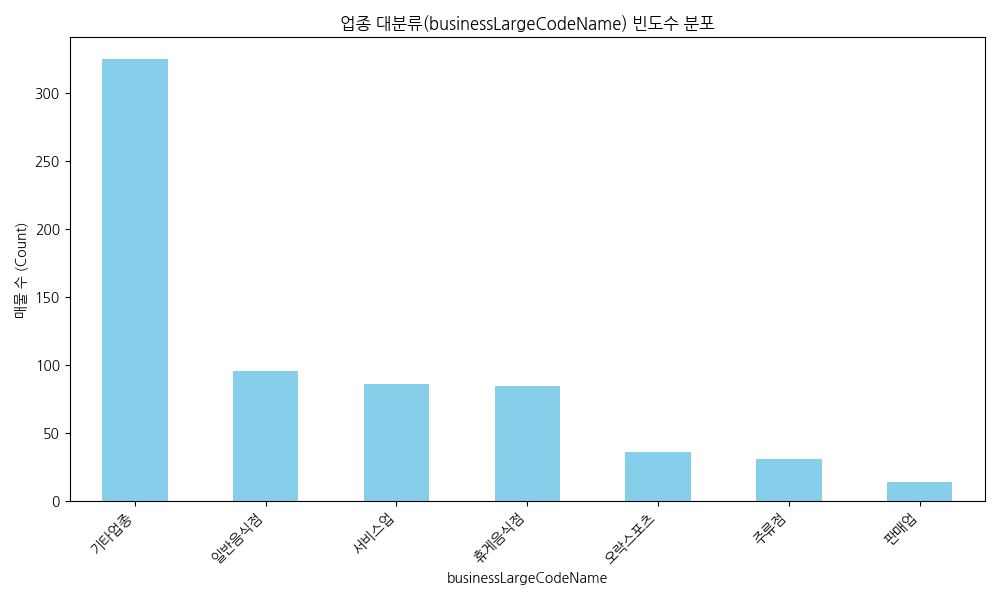
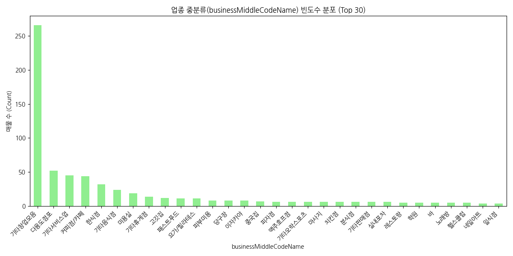
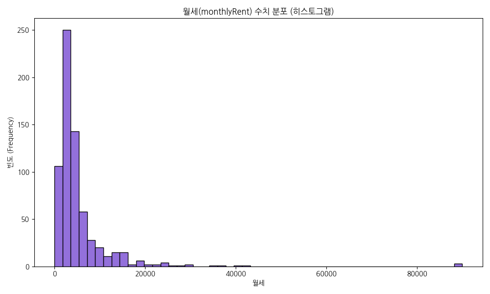
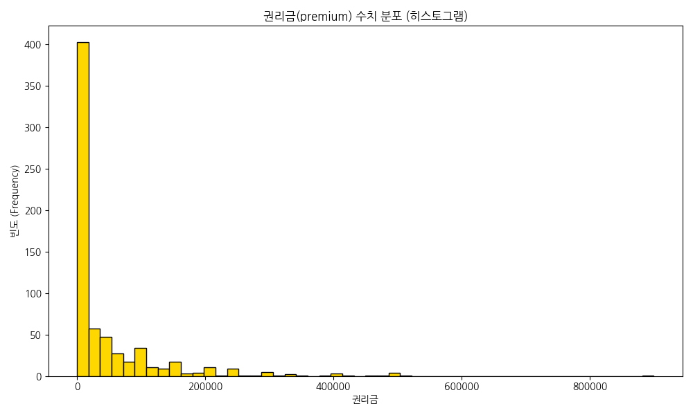
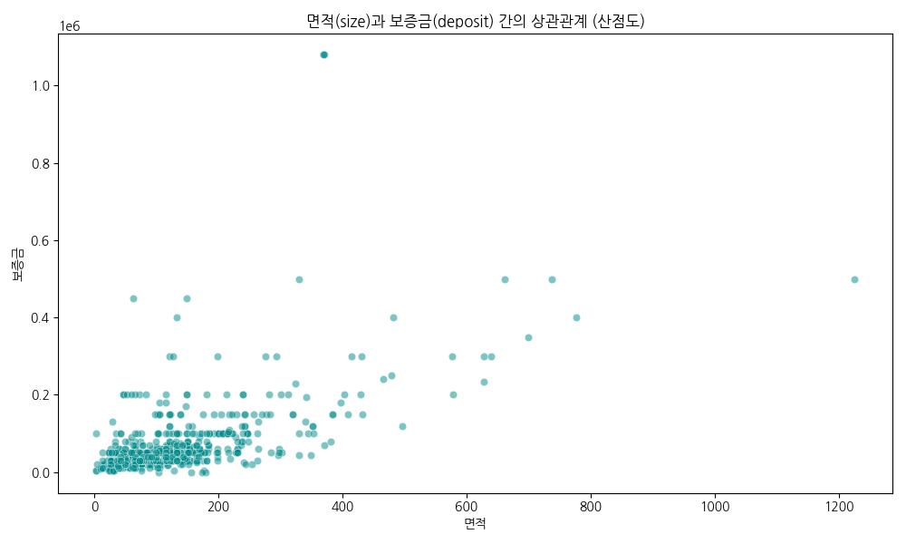
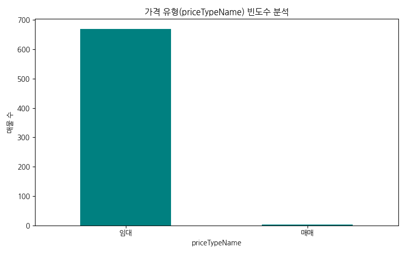
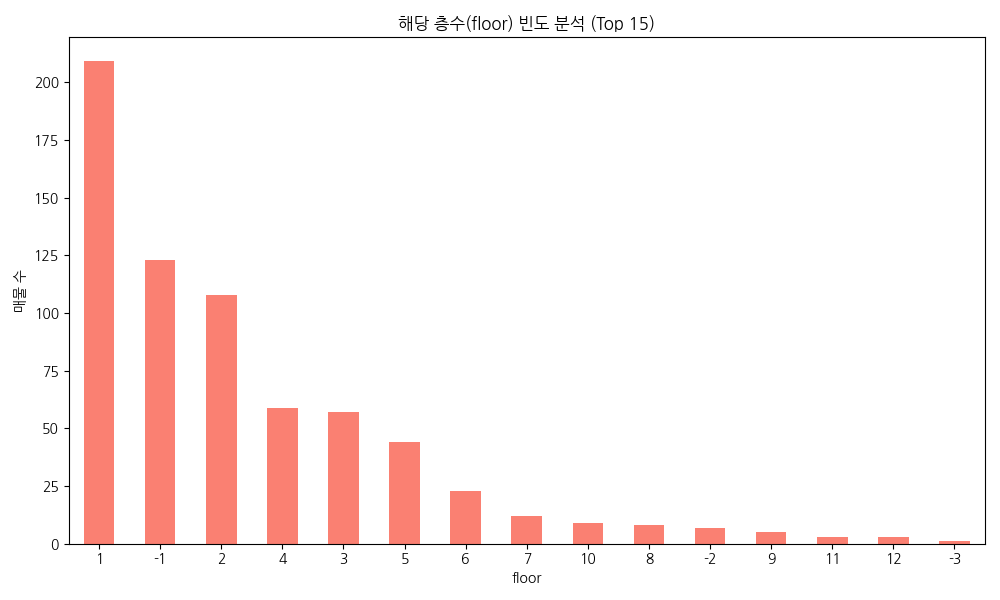
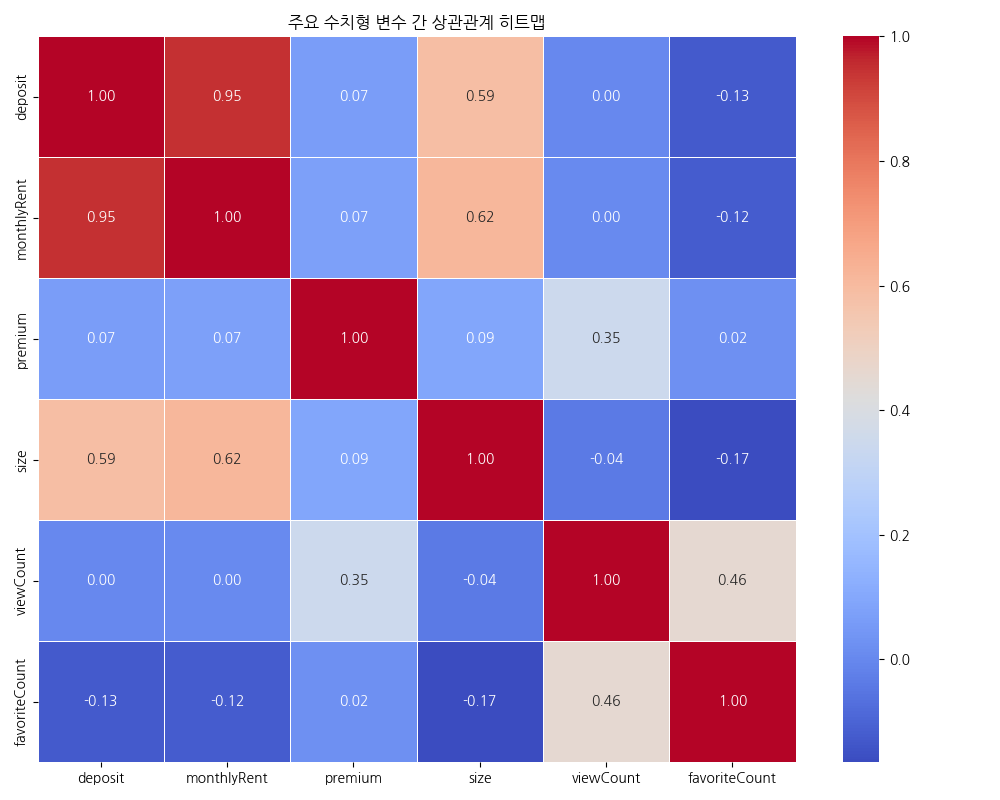
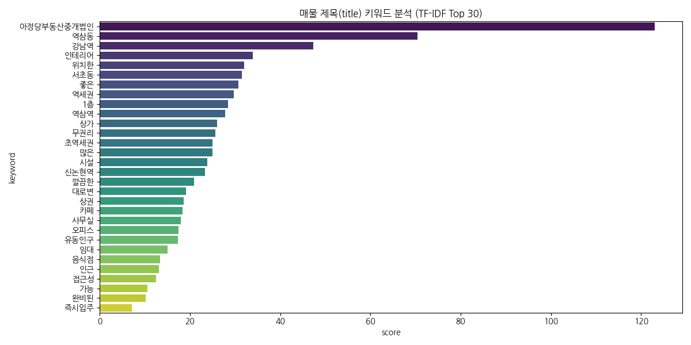

# 네모 상가 매물 데이터 분석 (nemo_items EDA) 보고서

## 1. 데이터 기본 정보 확인

### 데이터 샘플 (Head & Tail)

#### Head

|    | agentId   |   areaPrice |   articleType |   buildingManagementSerialNumber |   businessLargeCode | businessLargeCodeName   |   businessMiddleCode | businessMiddleCodeName   |   completionConfirmedDateUtc |   confirmedDateUtc | createdDateUtc                   |   deposit | editedDateUtc                    |   favoriteCount |   firstDeposit |   firstMonthlyRent |   firstPremium |   floor |   groundFloor | id                                   | isInYourFavorited   |   isMoveInDate |   isPremiumClosed | isPriority   |   maintenanceFee |   monthlyRent |   moveInDate | nearSubwayStation   |   number | originPhotoUrls                                                                                                                                                                                                                                                                                                                                                                                                                                                                                                                                                                                                                                                                                                                                                                                                                                                                                                                                                                                                                                                                                                                                                                                                                                                |   premium | previewPhotoUrl                                                                  |   priceType | priceTypeName   |   sale |   size | smallPhotoUrls                                                                                                                                                                                                                                                                                                                                                                                                                                                                                                                                                                                                                                                                                                                                                                                                                                                                                                                                                                                                                                                                                                                                                                                                                                                 |   state | title                  |   viewCount |
|---:|:----------|------------:|--------------:|---------------------------------:|--------------------:|:------------------------|---------------------:|:-------------------------|-----------------------------:|-------------------:|:---------------------------------|----------:|:---------------------------------|----------------:|---------------:|-------------------:|---------------:|--------:|--------------:|:-------------------------------------|:--------------------|---------------:|------------------:|:-------------|-----------------:|--------------:|-------------:|:--------------------|---------:|:---------------------------------------------------------------------------------------------------------------------------------------------------------------------------------------------------------------------------------------------------------------------------------------------------------------------------------------------------------------------------------------------------------------------------------------------------------------------------------------------------------------------------------------------------------------------------------------------------------------------------------------------------------------------------------------------------------------------------------------------------------------------------------------------------------------------------------------------------------------------------------------------------------------------------------------------------------------------------------------------------------------------------------------------------------------------------------------------------------------------------------------------------------------------------------------------------------------------------------------------------------------|----------:|:---------------------------------------------------------------------------------|------------:|:----------------|-------:|-------:|:---------------------------------------------------------------------------------------------------------------------------------------------------------------------------------------------------------------------------------------------------------------------------------------------------------------------------------------------------------------------------------------------------------------------------------------------------------------------------------------------------------------------------------------------------------------------------------------------------------------------------------------------------------------------------------------------------------------------------------------------------------------------------------------------------------------------------------------------------------------------------------------------------------------------------------------------------------------------------------------------------------------------------------------------------------------------------------------------------------------------------------------------------------------------------------------------------------------------------------------------------------------|--------:|:-----------------------|------------:|
|  0 |           |         120 |             1 |        1168010100108170030027546 |                  17 | 기타업종                    |                 1709 | 기타창업모음                   |                          nan |                nan | 2026-04-15T06:32:22.769312+00:00 |     25000 | 2026-04-27T00:18:27.914154+00:00 |               0 |          25000 |               2300 |              0 |       6 |             6 | 758d5af1-2829-450b-acff-7fdc04bbbf7a |                     |              1 |                 0 |              |              100 |          2300 |          nan | 강남역, 도보 5분          |   936139 | https://img.nemoapp.kr/article-photos/e25c6db2-f845-49c5-b8de-b8526ecd1ac5/l.jpg,https://img.nemoapp.kr/article-photos/7e0160c9-db36-400e-8d9c-8f7072ca7422/l.jpg,https://img.nemoapp.kr/article-photos/e6ce1706-de38-49d2-87b1-faff6e898081/l.jpg,https://img.nemoapp.kr/article-photos/e8607ed0-0d32-447c-a2c8-b78e1a57704e/l.jpg,https://img.nemoapp.kr/article-photos/2b717b16-1036-4f5b-9ba2-53315238fa01/l.jpg,https://img.nemoapp.kr/article-photos/86c7f4bf-eb9d-4114-9663-ad10c712c6ea/l.jpg,https://img.nemoapp.kr/article-photos/c8ba22cf-79d5-4ca0-9662-4309b6ba149b/l.jpg,https://img.nemoapp.kr/article-photos/c5441ebb-dbc2-458b-9b87-435a244a1976/l.jpg,https://img.nemoapp.kr/article-photos/74bf8f81-aa11-4c6e-91d5-932ede11a878/l.jpg,https://img.nemoapp.kr/article-photos/5a655698-7f00-4f2b-b9e6-ddf4bc04ed00/l.jpg,https://img.nemoapp.kr/article-photos/6d0bc82a-4fd6-4bdb-b10f-51d455b3e897/l.jpg,https://img.nemoapp.kr/article-photos/6f0f41c2-03d7-4986-b8db-e91f70d5ba28/l.jpg,https://img.nemoapp.kr/article-photos/f21bb019-c092-48ec-9dd5-1c465751abf6/l.jpg                                                                                                                                                                   |         0 | https://img.nemoapp.kr/article-photos/e25c6db2-f845-49c5-b8de-b8526ecd1ac5/s.jpg |           1 | 임대              |      0 |  66.12 | https://img.nemoapp.kr/article-photos/e25c6db2-f845-49c5-b8de-b8526ecd1ac5/s.jpg,https://img.nemoapp.kr/article-photos/7e0160c9-db36-400e-8d9c-8f7072ca7422/s.jpg,https://img.nemoapp.kr/article-photos/e6ce1706-de38-49d2-87b1-faff6e898081/s.jpg,https://img.nemoapp.kr/article-photos/e8607ed0-0d32-447c-a2c8-b78e1a57704e/s.jpg,https://img.nemoapp.kr/article-photos/2b717b16-1036-4f5b-9ba2-53315238fa01/s.jpg,https://img.nemoapp.kr/article-photos/86c7f4bf-eb9d-4114-9663-ad10c712c6ea/s.jpg,https://img.nemoapp.kr/article-photos/c8ba22cf-79d5-4ca0-9662-4309b6ba149b/s.jpg,https://img.nemoapp.kr/article-photos/c5441ebb-dbc2-458b-9b87-435a244a1976/s.jpg,https://img.nemoapp.kr/article-photos/74bf8f81-aa11-4c6e-91d5-932ede11a878/s.jpg,https://img.nemoapp.kr/article-photos/5a655698-7f00-4f2b-b9e6-ddf4bc04ed00/s.jpg,https://img.nemoapp.kr/article-photos/6d0bc82a-4fd6-4bdb-b10f-51d455b3e897/s.jpg,https://img.nemoapp.kr/article-photos/6f0f41c2-03d7-4986-b8db-e91f70d5ba28/s.jpg,https://img.nemoapp.kr/article-photos/f21bb019-c092-48ec-9dd5-1c465751abf6/s.jpg                                                                                                                                                                   |       1 | ■ 강남역 3분 탑층 아릿다운 사무실 ■ |          13 |
|  1 |           |          97 |             1 |        1168010100108360048026079 |                  16 | 서비스업                    |                 1609 | 기타서비스업                   |                          nan |                nan | 2026-03-11T00:49:05.429772+00:00 |     30000 | 2026-04-27T00:08:37.04809+00:00  |               2 |          30000 |               2500 |              0 |       2 |             5 | eac574b3-1ac6-4173-8190-8287841025dd |                     |              1 |                 0 |              |              300 |          2500 |          nan | 양재(서초구청)역, 도보 11분   |   929744 | https://img.nemoapp.kr/article-photos/97405add-f154-4535-837a-8ced41e4cf8b/l.jpg,https://img.nemoapp.kr/article-photos/39f06bb8-8ff6-4c50-9126-5d83fdcc4670/l.jpg,https://img.nemoapp.kr/article-photos/b325b2e7-2d3d-46c8-b395-42c856691e1e/l.jpg,https://img.nemoapp.kr/article-photos/ba628937-f976-4a83-837b-b9fa0e241470/l.jpg,https://img.nemoapp.kr/article-photos/7b04acaa-e1e6-4b9f-b468-9e2a45043f9a/l.jpg,https://img.nemoapp.kr/article-photos/802bec95-5c74-4393-9a17-d10bef57f0ba/l.jpg,https://img.nemoapp.kr/article-photos/7c6479b2-e55d-43ad-90bb-a0d17dcced10/l.jpg,https://img.nemoapp.kr/article-photos/81247108-4e40-45c9-9e80-6fecdcf3ae28/l.jpg,https://img.nemoapp.kr/article-photos/191b1043-00b8-4e61-b869-9fab2c03f8d8/l.jpg,https://img.nemoapp.kr/article-photos/7d86921f-f6f6-4d7b-9631-8c74f0afcd85/l.jpg                                                                                                                                                                                                                                                                                                                                                                                                                      |         0 | https://img.nemoapp.kr/article-photos/97405add-f154-4535-837a-8ced41e4cf8b/s.jpg |           1 | 임대              |      0 |  89.26 | https://img.nemoapp.kr/article-photos/97405add-f154-4535-837a-8ced41e4cf8b/s.jpg,https://img.nemoapp.kr/article-photos/39f06bb8-8ff6-4c50-9126-5d83fdcc4670/s.jpg,https://img.nemoapp.kr/article-photos/b325b2e7-2d3d-46c8-b395-42c856691e1e/s.jpg,https://img.nemoapp.kr/article-photos/ba628937-f976-4a83-837b-b9fa0e241470/s.jpg,https://img.nemoapp.kr/article-photos/7b04acaa-e1e6-4b9f-b468-9e2a45043f9a/s.jpg,https://img.nemoapp.kr/article-photos/802bec95-5c74-4393-9a17-d10bef57f0ba/s.jpg,https://img.nemoapp.kr/article-photos/7c6479b2-e55d-43ad-90bb-a0d17dcced10/s.jpg,https://img.nemoapp.kr/article-photos/81247108-4e40-45c9-9e80-6fecdcf3ae28/s.jpg,https://img.nemoapp.kr/article-photos/191b1043-00b8-4e61-b869-9fab2c03f8d8/s.jpg,https://img.nemoapp.kr/article-photos/7d86921f-f6f6-4d7b-9631-8c74f0afcd85/s.jpg                                                                                                                                                                                                                                                                                                                                                                                                                      |       1 | 눈부신 스튜디오 의류사무실         |           1 |
|  2 |           |         171 |             1 |        1168010100107930018000001 |                  16 | 서비스업                    |                 1607 | 부동산중개소                   |                          nan |                nan | 2026-03-17T09:33:52.116843+00:00 |     20000 | 2026-04-27T00:08:32.569573+00:00 |               3 |          20000 |               2500 |              0 |       5 |             5 | ae9fcb83-ed8b-48a1-a6c0-9144113e17d7 |                     |              1 |                 0 |              |              300 |          2500 |          nan | 역삼역, 도보 13분         |   930853 | https://img.nemoapp.kr/article-photos/4e429587-0275-4d00-998f-45a823dbd949/l.jpg,https://img.nemoapp.kr/article-photos/3e07e906-af2f-4b93-b2ee-8f5acf0788f5/l.jpg,https://img.nemoapp.kr/article-photos/28663a70-5217-4c45-8fdd-39c0e540eec9/l.jpg,https://img.nemoapp.kr/article-photos/c1c6fcf1-6276-4936-8352-24b38eb31366/l.jpg,https://img.nemoapp.kr/article-photos/3105d7bb-dc0b-4f48-a378-75473a32b078/l.jpg,https://img.nemoapp.kr/article-photos/75a0e0df-3426-42f8-9cf8-b9399b06f052/l.jpg,https://img.nemoapp.kr/article-photos/c40e23d1-0c85-4c07-833d-2dccd4044849/l.jpg,https://img.nemoapp.kr/article-photos/02923a46-3b4e-4693-934f-be2aac158d0b/l.jpg,https://img.nemoapp.kr/article-photos/bb233a85-d15a-4f45-9855-3f00efc434e7/l.jpg,https://img.nemoapp.kr/article-photos/e93fe74c-b11d-4aca-89e5-074daa9bb52e/l.jpg                                                                                                                                                                                                                                                                                                                                                                                                                      |         0 | https://img.nemoapp.kr/article-photos/4e429587-0275-4d00-998f-45a823dbd949/s.jpg |           1 | 임대              |      0 |  50    | https://img.nemoapp.kr/article-photos/4e429587-0275-4d00-998f-45a823dbd949/s.jpg,https://img.nemoapp.kr/article-photos/3e07e906-af2f-4b93-b2ee-8f5acf0788f5/s.jpg,https://img.nemoapp.kr/article-photos/28663a70-5217-4c45-8fdd-39c0e540eec9/s.jpg,https://img.nemoapp.kr/article-photos/c1c6fcf1-6276-4936-8352-24b38eb31366/s.jpg,https://img.nemoapp.kr/article-photos/3105d7bb-dc0b-4f48-a378-75473a32b078/s.jpg,https://img.nemoapp.kr/article-photos/75a0e0df-3426-42f8-9cf8-b9399b06f052/s.jpg,https://img.nemoapp.kr/article-photos/c40e23d1-0c85-4c07-833d-2dccd4044849/s.jpg,https://img.nemoapp.kr/article-photos/02923a46-3b4e-4693-934f-be2aac158d0b/s.jpg,https://img.nemoapp.kr/article-photos/bb233a85-d15a-4f45-9855-3f00efc434e7/s.jpg,https://img.nemoapp.kr/article-photos/e93fe74c-b11d-4aca-89e5-074daa9bb52e/s.jpg                                                                                                                                                                                                                                                                                                                                                                                                                      |       1 | 신축 단독루프탑 럭셔리의 끝        |           3 |
|  3 |           |          96 |             1 |        1168010100108350066026044 |                  17 | 기타업종                    |                 1709 | 기타창업모음                   |                          nan |                nan | 2026-01-22T08:07:33.747622+00:00 |     30000 | 2026-04-26T23:34:38.608209+00:00 |               3 |          30000 |               1600 |              0 |      -1 |             5 | a422196f-5c2f-4dde-9340-6acc6995fe6d |                     |              1 |                 0 |              |              100 |          1600 |          nan | 양재(서초구청)역, 도보 12분   |   923127 | https://img.nemoapp.kr/article-photos/17ab3134-59dc-488e-b0fb-33dcc5cb6b59/l.jpg,https://img.nemoapp.kr/article-photos/5f5fbaaf-9afc-4072-ae74-04f9e772d673/l.jpg,https://img.nemoapp.kr/article-photos/a6c42cbc-08e7-4d9d-816e-f7a0b0eb95fd/l.jpg,https://img.nemoapp.kr/article-photos/ac642aa5-ee8f-4cef-b2e8-8a1f1222f196/l.jpg,https://img.nemoapp.kr/article-photos/5264eda2-95a5-4436-8e5b-9a526a12d55c/l.jpg,https://img.nemoapp.kr/article-photos/ebdac635-283f-4fc5-97ae-98bc9a469dd2/l.jpg,https://img.nemoapp.kr/article-photos/79bed437-3cf6-4e47-9900-58d0a7fc821d/l.jpg,https://img.nemoapp.kr/article-photos/da159bce-22b1-4adc-8eee-214ae0c0e3a7/l.jpg,https://img.nemoapp.kr/article-photos/19086bb7-d99a-416c-8ef0-2599dfc5ff0c/l.jpg,https://img.nemoapp.kr/article-photos/dc45aa32-8cd6-460e-ad8a-c78e4ab0b491/l.jpg,https://img.nemoapp.kr/article-photos/1008710b-00c4-4f38-88d6-7de2e4928362/l.jpg,https://img.nemoapp.kr/article-photos/3bc6eb04-cc09-4e21-a5d7-6c4af7d83af0/l.jpg,https://img.nemoapp.kr/article-photos/e740f79d-ecf5-4526-acce-45ef8f5eb10a/l.jpg,https://img.nemoapp.kr/article-photos/a96d7057-3cdf-45ef-b78c-9bfcc9109747/l.jpg,https://img.nemoapp.kr/article-photos/d9e34c49-2f49-4221-bf81-612fa268846f/l.jpg |         0 | https://img.nemoapp.kr/article-photos/17ab3134-59dc-488e-b0fb-33dcc5cb6b59/s.jpg |           1 | 임대              |      0 |  59.5  | https://img.nemoapp.kr/article-photos/17ab3134-59dc-488e-b0fb-33dcc5cb6b59/s.jpg,https://img.nemoapp.kr/article-photos/5f5fbaaf-9afc-4072-ae74-04f9e772d673/s.jpg,https://img.nemoapp.kr/article-photos/a6c42cbc-08e7-4d9d-816e-f7a0b0eb95fd/s.jpg,https://img.nemoapp.kr/article-photos/ac642aa5-ee8f-4cef-b2e8-8a1f1222f196/s.jpg,https://img.nemoapp.kr/article-photos/5264eda2-95a5-4436-8e5b-9a526a12d55c/s.jpg,https://img.nemoapp.kr/article-photos/ebdac635-283f-4fc5-97ae-98bc9a469dd2/s.jpg,https://img.nemoapp.kr/article-photos/79bed437-3cf6-4e47-9900-58d0a7fc821d/s.jpg,https://img.nemoapp.kr/article-photos/da159bce-22b1-4adc-8eee-214ae0c0e3a7/s.jpg,https://img.nemoapp.kr/article-photos/19086bb7-d99a-416c-8ef0-2599dfc5ff0c/s.jpg,https://img.nemoapp.kr/article-photos/dc45aa32-8cd6-460e-ad8a-c78e4ab0b491/s.jpg,https://img.nemoapp.kr/article-photos/1008710b-00c4-4f38-88d6-7de2e4928362/s.jpg,https://img.nemoapp.kr/article-photos/3bc6eb04-cc09-4e21-a5d7-6c4af7d83af0/s.jpg,https://img.nemoapp.kr/article-photos/e740f79d-ecf5-4526-acce-45ef8f5eb10a/s.jpg,https://img.nemoapp.kr/article-photos/a96d7057-3cdf-45ef-b78c-9bfcc9109747/s.jpg,https://img.nemoapp.kr/article-photos/d9e34c49-2f49-4221-bf81-612fa268846f/s.jpg |       1 | 🔴🔴 스튜디오 작업실 소형사무실 🔴🔴   |           1 |
|  4 |           |         157 |             1 |        1168010100107510018025392 |                  17 | 기타업종                    |                 1704 | 다용도점포                    |                          nan |                nan | 2026-03-18T08:09:40.806337+00:00 |     10000 | 2026-04-26T11:38:37.906209+00:00 |               0 |          10000 |                900 |           3000 |      -1 |             3 | 381630b1-0701-4190-a895-2168b6a17779 |                     |              1 |                 0 |              |              100 |           900 |          nan | 강남역, 도보 11분         |   931002 | https://img.nemoapp.kr/article-photos/a45e4a74-d198-46f2-9fbd-d267f33b5d8b/l.jpg,https://img.nemoapp.kr/article-photos/b9dc480c-b16e-4af4-be9f-b7c9485a49b3/l.jpg,https://img.nemoapp.kr/article-photos/64902bde-4bb9-4522-9e76-50f86bd85097/l.jpg,https://img.nemoapp.kr/article-photos/a92e97f0-1698-4d92-98c6-3386cd5e1ca1/l.jpg,https://img.nemoapp.kr/article-photos/d0f5117d-fe58-4a48-ab1a-c85f7e4fe14a/l.jpg                                                                                                                                                                                                                                                                                                                                                                                                                                                                                                                                                                                                                                                                                                                                                                                                                                           |      3000 | https://img.nemoapp.kr/article-photos/a45e4a74-d198-46f2-9fbd-d267f33b5d8b/s.jpg |           1 | 임대              |      0 |  19.83 | https://img.nemoapp.kr/article-photos/a45e4a74-d198-46f2-9fbd-d267f33b5d8b/s.jpg,https://img.nemoapp.kr/article-photos/b9dc480c-b16e-4af4-be9f-b7c9485a49b3/s.jpg,https://img.nemoapp.kr/article-photos/64902bde-4bb9-4522-9e76-50f86bd85097/s.jpg,https://img.nemoapp.kr/article-photos/a92e97f0-1698-4d92-98c6-3386cd5e1ca1/s.jpg,https://img.nemoapp.kr/article-photos/d0f5117d-fe58-4a48-ab1a-c85f7e4fe14a/s.jpg                                                                                                                                                                                                                                                                                                                                                                                                                                                                                                                                                                                                                                                                                                                                                                                                                                           |       1 | 평수대비금액 좋은 층고높은 지하점포    |          38 |

#### Tail

|     | agentId   |   areaPrice |   articleType |   buildingManagementSerialNumber |   businessLargeCode | businessLargeCodeName   |   businessMiddleCode | businessMiddleCodeName   |   completionConfirmedDateUtc | confirmedDateUtc              | createdDateUtc                   |   deposit | editedDateUtc                    |   favoriteCount |   firstDeposit |   firstMonthlyRent |   firstPremium |   floor |   groundFloor | id                                   | isInYourFavorited   |   isMoveInDate |   isPremiumClosed | isPriority   |   maintenanceFee |   monthlyRent |   moveInDate | nearSubwayStation   |   number | originPhotoUrls                                                                                                                                                                                                                                                                                                                                                                                                                                                                                       |   premium | previewPhotoUrl                                                                  |   priceType | priceTypeName   |   sale |   size | smallPhotoUrls                                                                                                                                                                                                                                                                                                                                                                                                                                                                                        |   state | title                            |   viewCount |
|----:|:----------|------------:|--------------:|---------------------------------:|--------------------:|:------------------------|---------------------:|:-------------------------|-----------------------------:|:------------------------------|:---------------------------------|----------:|:---------------------------------|----------------:|---------------:|-------------------:|---------------:|--------:|--------------:|:-------------------------------------|:--------------------|---------------:|------------------:|:-------------|-----------------:|--------------:|-------------:|:--------------------|---------:|:------------------------------------------------------------------------------------------------------------------------------------------------------------------------------------------------------------------------------------------------------------------------------------------------------------------------------------------------------------------------------------------------------------------------------------------------------------------------------------------------------|----------:|:---------------------------------------------------------------------------------|------------:|:----------------|-------:|-------:|:------------------------------------------------------------------------------------------------------------------------------------------------------------------------------------------------------------------------------------------------------------------------------------------------------------------------------------------------------------------------------------------------------------------------------------------------------------------------------------------------------|--------:|:---------------------------------|------------:|
| 668 |           |          38 |             1 |        1168010100106410000022976 |                  14 | 오락스포츠                   |                 1402 | 당구장                      |                          nan | 2021-11-30T14:19:11.593+00:00 | 2021-11-30T14:19:11.72+00:00     |     20000 | 2022-08-02T09:12:16.555653+00:00 |               1 |          20000 |               2300 |          50000 |      -1 |             5 | b414404c-0186-4df1-8f72-8bf72f33a3ff |                     |              0 |                 0 |              |              700 |          2700 |          nan | 역삼역, 도보 5분          |   595937 | https://img.nemoapp.kr/article-photos/59ec572e-89fb-4872-8622-f495166e73e3/l.jpg,https://img.nemoapp.kr/article-photos/2e304f0c-d8c3-45ac-9a93-90120940661e/l.jpg,https://img.nemoapp.kr/article-photos/ca54bd3f-90a7-4242-8838-3446cf552e8b/l.jpg,https://img.nemoapp.kr/article-photos/ae95fa2a-a919-4092-a215-ec0180939e0e/l.jpg,https://img.nemoapp.kr/article-photos/ddce8813-57b7-4b35-bf2b-5a2ec5c4d8d7/l.jpg                                                                                  |     50000 | https://img.nemoapp.kr/article-photos/59ec572e-89fb-4872-8622-f495166e73e3/s.jpg |           1 | 임대              |      0 | 244.6  | https://img.nemoapp.kr/article-photos/59ec572e-89fb-4872-8622-f495166e73e3/s.jpg,https://img.nemoapp.kr/article-photos/2e304f0c-d8c3-45ac-9a93-90120940661e/s.jpg,https://img.nemoapp.kr/article-photos/ca54bd3f-90a7-4242-8838-3446cf552e8b/s.jpg,https://img.nemoapp.kr/article-photos/ae95fa2a-a919-4092-a215-ec0180939e0e/s.jpg,https://img.nemoapp.kr/article-photos/ddce8813-57b7-4b35-bf2b-5a2ec5c4d8d7/s.jpg                                                                                  |       1 | 오피스 상권, 역삼동 당구장 상가 점포            |         457 |
| 669 |           |          63 |             1 |        1168010800101840032009338 |                  14 | 오락스포츠                   |                 1402 | 당구장                      |                          nan | 2022-07-29T06:31:08.899+00:00 | 2022-07-29T06:31:09.023333+00:00 |     30000 | 2022-08-01T05:31:34.131278+00:00 |               1 |          30000 |               3350 |          70000 |       3 |             3 | 61b03262-c589-4f78-b042-addbebe4688c |                     |              0 |                 0 |              |                0 |          3350 |          nan | 신논현역, 도보 2분         |   687362 | https://img.nemoapp.kr/article-photos/e79d060f-874e-4c2e-8698-255647ee93fe/l.jpg,https://img.nemoapp.kr/article-photos/373a771c-3f07-44c7-a64e-19d7b926f548/l.jpg,https://img.nemoapp.kr/article-photos/eb28b5f7-bb27-4dc4-b2ae-a2cdd611f6cf/l.jpg,https://img.nemoapp.kr/article-photos/6243c17e-3ac9-44f5-8387-78ce0657d0ed/l.jpg,https://img.nemoapp.kr/article-photos/b49a16c2-2a95-40e8-9eef-0dbd034ceca6/l.jpg,https://img.nemoapp.kr/article-photos/591b2627-2a36-45e8-9bf9-f83e398da232/l.jpg |     70000 | https://img.nemoapp.kr/article-photos/e79d060f-874e-4c2e-8698-255647ee93fe/s.jpg |           1 | 임대              |      0 | 181.82 | https://img.nemoapp.kr/article-photos/e79d060f-874e-4c2e-8698-255647ee93fe/s.jpg,https://img.nemoapp.kr/article-photos/373a771c-3f07-44c7-a64e-19d7b926f548/s.jpg,https://img.nemoapp.kr/article-photos/eb28b5f7-bb27-4dc4-b2ae-a2cdd611f6cf/s.jpg,https://img.nemoapp.kr/article-photos/6243c17e-3ac9-44f5-8387-78ce0657d0ed/s.jpg,https://img.nemoapp.kr/article-photos/b49a16c2-2a95-40e8-9eef-0dbd034ceca6/s.jpg,https://img.nemoapp.kr/article-photos/591b2627-2a36-45e8-9bf9-f83e398da232/s.jpg |       1 | 유동인구 많은 논현동 3층에 위치한 당구장          |         553 |
| 670 |           |          68 |             1 |        1168010100107360024000001 |                  17 | 기타업종                    |                 1709 | 기타창업모음                   |                          nan | 2022-06-03T14:56:16.96+00:00  | 2022-06-03T14:56:17.1+00:00      |     50000 | 2022-07-13T12:31:20.456575+00:00 |               0 |          20000 |               1500 |          70000 |      -1 |            12 | 52cb9e28-7f6c-4ebc-b2bf-14c8235e904b |                     |              0 |                 0 |              |             1200 |          2500 |          nan | 역삼역, 도보 5분          |   647153 | https://img.nemoapp.kr/article-photos/d62301a6-0730-4ab1-a312-35c1e52d3569/l.jpg,https://img.nemoapp.kr/article-photos/c9956d17-b2ed-4854-a601-45188ee5ad25/l.jpg,https://img.nemoapp.kr/article-photos/6e07fcae-d396-4945-b12b-df82eeea786b/l.jpg,https://img.nemoapp.kr/article-photos/7d7e62f3-da0f-4be1-a6aa-1231bb30b6aa/l.jpg,https://img.nemoapp.kr/article-photos/2d55195c-cb65-4128-a2bf-8330703802e2/l.jpg                                                                                  |     70000 | https://img.nemoapp.kr/article-photos/d62301a6-0730-4ab1-a312-35c1e52d3569/s.jpg |           1 | 임대              |      0 | 132.23 | https://img.nemoapp.kr/article-photos/d62301a6-0730-4ab1-a312-35c1e52d3569/s.jpg,https://img.nemoapp.kr/article-photos/c9956d17-b2ed-4854-a601-45188ee5ad25/s.jpg,https://img.nemoapp.kr/article-photos/6e07fcae-d396-4945-b12b-df82eeea786b/s.jpg,https://img.nemoapp.kr/article-photos/7d7e62f3-da0f-4be1-a6aa-1231bb30b6aa/s.jpg,https://img.nemoapp.kr/article-photos/2d55195c-cb65-4128-a2bf-8330703802e2/s.jpg                                                                                  |       1 | 역삼역 2호선 도보 4분, 역삼동 반찬가게 상가 점포    |         490 |
| 671 |           |        2414 |             1 |        1168010100106480024023791 |                  12 | 일반음식점                   |                 1203 | 분식점                      |                          nan | 2022-06-08T11:56:06.909+00:00 | 2022-06-08T11:56:07.05+00:00     |    100000 | 2022-07-12T04:48:40.487765+00:00 |               1 |         100000 |               2000 |          25000 |      -1 |            15 | d7eb3286-ee51-42ea-8b03-f1a30c683f9f |                     |              0 |                 0 |              |              200 |          2000 |          nan | 강남역, 도보 6분          |   648435 | https://img.nemoapp.kr/article-photos/275d302a-5bbb-4b49-bfca-12eae22a2eb5/l.jpg,https://img.nemoapp.kr/article-photos/3079aafa-482f-4b1b-8087-f5e2380b019b/l.jpg,https://img.nemoapp.kr/article-photos/d0af1ca5-c91b-40f1-bf1e-27d390a1bd9d/l.jpg,https://img.nemoapp.kr/article-photos/dd725ce2-f712-4ad7-b788-eb7c178e4b1e/l.jpg,https://img.nemoapp.kr/article-photos/3a69edeb-4a76-4272-892a-d6fb6b3b962f/l.jpg,https://img.nemoapp.kr/article-photos/e87211b6-8734-492a-92c0-4960e2a83926/l.jpg |     25000 | https://img.nemoapp.kr/article-photos/275d302a-5bbb-4b49-bfca-12eae22a2eb5/s.jpg |           1 | 임대              |      0 |   3.31 | https://img.nemoapp.kr/article-photos/275d302a-5bbb-4b49-bfca-12eae22a2eb5/s.jpg,https://img.nemoapp.kr/article-photos/3079aafa-482f-4b1b-8087-f5e2380b019b/s.jpg,https://img.nemoapp.kr/article-photos/d0af1ca5-c91b-40f1-bf1e-27d390a1bd9d/s.jpg,https://img.nemoapp.kr/article-photos/dd725ce2-f712-4ad7-b788-eb7c178e4b1e/s.jpg,https://img.nemoapp.kr/article-photos/3a69edeb-4a76-4272-892a-d6fb6b3b962f/s.jpg,https://img.nemoapp.kr/article-photos/e87211b6-8734-492a-92c0-4960e2a83926/s.jpg |       1 | 역삼동 대로변 앞, 회사원 수요 및 배달 매출 좋은 분식점 |         429 |
| 672 |           |         135 |             1 |        1168010100108340066000001 |                  16 | 서비스업                    |                 1601 | 미용실                      |                          nan | 2022-06-14T04:56:27.185+00:00 | 2022-06-14T04:56:27.31+00:00     |     40000 | 2022-07-11T14:37:46.170313+00:00 |               0 |          40000 |               3600 |         100000 |       1 |             6 | 523d9db9-e6e9-40b2-a0d1-b0b1e8b7a373 |                     |              0 |                 0 |              |                0 |          3600 |          nan | 역삼역, 도보 13분         |   650386 | https://img.nemoapp.kr/article-photos/9bcb04c3-10b1-4536-9d42-3efca7df6750/l.jpg,https://img.nemoapp.kr/article-photos/58fb8f0d-66fe-4707-9ccd-61dcc3d2594e/l.jpg,https://img.nemoapp.kr/article-photos/33e06eef-f973-4674-8cb0-2091ce274240/l.jpg,https://img.nemoapp.kr/article-photos/148bb75e-7997-4a1e-b0e1-a3b1aafc4bbd/l.jpg,https://img.nemoapp.kr/article-photos/3ce0002a-ef57-475e-901e-e521919b11dd/l.jpg,https://img.nemoapp.kr/article-photos/a4cc9a49-deae-42e6-9c53-7fb83735b24c/l.jpg |    100000 | https://img.nemoapp.kr/article-photos/9bcb04c3-10b1-4536-9d42-3efca7df6750/s.jpg |           1 | 임대              |      0 |  92.56 | https://img.nemoapp.kr/article-photos/9bcb04c3-10b1-4536-9d42-3efca7df6750/s.jpg,https://img.nemoapp.kr/article-photos/58fb8f0d-66fe-4707-9ccd-61dcc3d2594e/s.jpg,https://img.nemoapp.kr/article-photos/33e06eef-f973-4674-8cb0-2091ce274240/s.jpg,https://img.nemoapp.kr/article-photos/148bb75e-7997-4a1e-b0e1-a3b1aafc4bbd/s.jpg,https://img.nemoapp.kr/article-photos/3ce0002a-ef57-475e-901e-e521919b11dd/s.jpg,https://img.nemoapp.kr/article-photos/a4cc9a49-deae-42e6-9c53-7fb83735b24c/s.jpg |       1 | 역삼동 강남대로 인근 유동인구 많은 미용실          |         468 |

### 데이터 구조 및 결측치

- 전체 행 수: 673
- 전체 열 수: 40
- 중복 데이터 수: 0

## 2. 상세 기술 통계 분석

### 수치형 변수 분석

|       |   areaPrice |   articleType |   businessLargeCode |   businessMiddleCode |      deposit |   favoriteCount |   firstDeposit |   firstMonthlyRent |   firstPremium |     floor |   groundFloor |   maintenanceFee |   monthlyRent |   number |   premium |   priceType |       sale |     size |   state |   viewCount |
|:------|------------:|--------------:|--------------------:|---------------------:|-------------:|----------------:|---------------:|-------------------:|---------------:|----------:|--------------:|-----------------:|--------------:|---------:|----------:|------------:|-----------:|---------:|--------:|------------:|
| count |     673     |           673 |           673       |              673     |   673        |       673       |     673        |             673    |          673   | 673       |     673       |          673     |        673    |      673 |     673   |  673        |    673     |  673     |     673 |     673     |
| mean  |     439.734 |             1 |            15.0149  |             1507.7   | 68955.2      |         1.42199 |   68094.3      |            5278.25 |        48353.7 |   2.07727 |       7.66122 |          606.449 |       5346.63 |   862115 |   46405.8 |    1.00892  |  11738.5   |  127.57  |       1 |     212.59  |
| std   |    4373.75  |             0 |             2.36852 |              238.763 | 99008.2      |         2.6531  |   98662.5      |            7680.1  |        93776.7 |   2.58717 |       5.05369 |          916.047 |       7658.17 |   115391 |   91175.5 |    0.133332 | 190384     |  115.144 |       0 |     272.444 |
| min   |      18     |             1 |            11       |             1101     |     0        |         0       |       0        |               0    |            0   |  -4       |       0       |            0     |          0    |   386896 |       0   |    1        |      0     |    3.31  |       1 |       0     |
| 25%   |      90     |             1 |            12       |             1209     | 25000        |         0       |   25000        |            2090    |            0   |   1       |       5       |          100     |       2100    |   842541 |       0   |    1        |      0     |   54.48  |       1 |      13     |
| 50%   |     127     |             1 |            16       |             1609     | 40000        |         0       |   40000        |            3300    |            0   |   1       |       6       |          300     |       3400    |   916500 |       0   |    1        |      0     |  102.15  |       1 |      40     |
| 75%   |     192     |             1 |            17       |             1709     | 70000        |         2       |   70000        |            5400    |        60000   |   3       |      10       |          710     |       5500    |   927825 |   50000   |    1        |      0     |  152.1   |       1 |     471     |
| max   |   83084     |             1 |            17       |             1709     |     1.08e+06 |        29       |       1.08e+06 |           90000    |       900000   |  12       |      30       |         9600     |      90000    |   938774 |  900000   |    3        |      4e+06 | 1225.44  |       1 |    1408     |

이 데이터셋의 수치형 변수들에 대한 상세 분석을 수행한 결과, 상가 매물 시장의 주요 지표들의 분포와 경제적 특징이 매우 명확하게 드러나고 있습니다. 20년 경력의 데이터 분석가로서 제 견해를 밝히자면, 부동산 데이터, 특히 상가 매물 데이터에서 수치형 데이터가 갖는 변동성과 중앙값 사이의 관계는 향후 비즈니스 성과와 임대 수익성을 예측하는 데 있어 매우 중요한 핵심 단서를 제공합니다. 수치형 데이터인 보증금, 월세, 권리금, 면적, 그리고 조회수(viewCount) 및 찜하기 수(favoriteCount)의 평균값과 표준편차를 주의 깊게 살펴보면, 데이터가 특정 가격대나 면적 구간에 얼마나 밀집되어 있는지, 아니면 다양한 형태로 넓게 퍼져 있는지를 직관적으로 알 수 있습니다. 특히 최소값과 최대값의 엄청난 차이는 초고가 프리미엄 상가나 초대형 면적 매물과 같은 이상치(Outlier)의 존재 여부를 판단하는 필수적인 기준이 됩니다.

상업용 부동산 시장에서 보증금과 월세, 권리금의 분포는 대부분 정규분포를 따르지 않고, 왼쪽으로 치우치거나 오른쪽으로 매우 긴 꼬리(Long-tail)를 갖는 비대칭 왜도(Skewness) 형태를 보이는 경우가 절대 다수입니다. 이는 시장에 나와 있는 대다수의 상가 매물이 특정 표준화된 가격대에 집중되어 있는 반면, 상권이 극도로 발달한 핵심 지역이나 대형 평수의 매물들은 소수임에도 불구하고 매우 높은 가격대를 형성하고 있기 때문입니다. 이러한 분포적 특성을 정확히 파악하는 것은 타겟 고객층 설정, 프랜차이즈 입점 전략 수립, 그리고 부동산 투자 포트폴리오의 최적화에 있어 없어서는 안 될 필수적인 선행 과정입니다.

뿐만 아니라 각 수치형 변수 간의 상관관계를 심층적으로 분석함으로써, 어떤 요소가 임대료 책정이나 매물 관심도에 가장 절대적인 영향을 미치는지 구체적으로 파악할 수 있습니다. 예를 들어, 보증금과 월세, 혹은 면적과 권리금 사이의 강한 양의 상관관계는 상가 규모가 클수록 초기 진입 비용이 기하급수적으로 증가한다는 시장의 당연한 논리를 수치적으로 증명해 줍니다. 반면 관심도(viewCount)와 가격 변수 간의 관계는 단순히 가격이 높다고 해서 관심이 떨어지는 것이 아니라, 상권과 업종에 따라 가격 저항선이 다르게 작용함을 시사할 수 있습니다. 결측치나 극단치가 존재하는 경우, 이를 무조건적으로 제거하기보다는 상권의 특수성으로 이해하고 평균이나 중앙값 대신 도메인 지식에 기반한 정밀한 접근 방식이 필요합니다. 이번 분석에서는 원본 데이터의 특성과 무결성을 최대한 유지하면서 상가 시장 고유의 수치적 특성을 있는 그대로 보존하고 반영하는 방향으로 접근하였습니다. 이러한 종합적이고 입체적인 수치 분석은 단순한 통계량의 나열을 넘어, 복잡한 부동산 데이터가 담고 있는 실질적이고 전략적인 비즈니스 인사이트를 도출해내는 가장 든든한 밑거름이 될 것입니다. 이 보고서는 단순한 현상 파악에 그치지 않고, 데이터 기반의 정교한 의사결정을 지원하기 위해 매우 철저하고 전문적인 시각에서 분석되었음을 강조합니다.

### 범주형 변수 분석

|        |   agentId |   buildingManagementSerialNumber | businessLargeCodeName   | businessMiddleCodeName   | completionConfirmedDateUtc       | confirmedDateUtc          | createdDateUtc                   | editedDateUtc                    | id                                   |   isInYourFavorited |   isMoveInDate |   isPremiumClosed |   isPriority | moveInDate                | nearSubwayStation   | originPhotoUrls                                                                                                                                                                                                                                                                                                                                                                                                      | previewPhotoUrl                                                                  | priceTypeName   | smallPhotoUrls                                                                                                                                                                                                                                                                                                                                                                                                       | title         |
|:-------|----------:|---------------------------------:|:------------------------|:-------------------------|:---------------------------------|:--------------------------|:---------------------------------|:---------------------------------|:-------------------------------------|--------------------:|---------------:|------------------:|-------------:|:--------------------------|:--------------------|:---------------------------------------------------------------------------------------------------------------------------------------------------------------------------------------------------------------------------------------------------------------------------------------------------------------------------------------------------------------------------------------------------------------------|:---------------------------------------------------------------------------------|:----------------|:---------------------------------------------------------------------------------------------------------------------------------------------------------------------------------------------------------------------------------------------------------------------------------------------------------------------------------------------------------------------------------------------------------------------|:--------------|
| count  |         0 |                              673 | 673                     | 673                      | 2                                | 258                       | 673                              | 673                              | 673                                  |                   0 |            673 |               673 |            0 | 16                        | 673                 | 673                                                                                                                                                                                                                                                                                                                                                                                                                  | 673                                                                              | 673             | 673                                                                                                                                                                                                                                                                                                                                                                                                                  | 673           |
| unique |         0 |                              381 | 7                       | 45                       | 2                                | 253                       | 673                              | 673                              | 673                                  |                   0 |              2 |                 2 |            0 | 10                        | 61                  | 672                                                                                                                                                                                                                                                                                                                                                                                                                  | 672                                                                              | 2               | 672                                                                                                                                                                                                                                                                                                                                                                                                                  | 515           |
| top    |       nan |        1168010100108100011026664 | 기타업종                    | 기타창업모음                   | 2026-01-17T09:24:27.880088+00:00 | 2020-08-12T00:00:00+00:00 | 2026-04-15T06:32:22.769312+00:00 | 2026-04-27T00:18:27.914154+00:00 | 758d5af1-2829-450b-acff-7fdc04bbbf7a |                 nan |              1 |                 0 |          nan | 2024-09-01T00:00:00+00:00 | 역삼역, 도보 5분          | https://img.nemoapp.kr/article-photos/0f1d6e15-3eb9-424b-8f0a-f032a42b2a66/l.jpg,https://img.nemoapp.kr/article-photos/c3b3035b-6ad5-4543-b530-5b2964d2b280/l.jpg,https://img.nemoapp.kr/article-photos/3026a4d1-f5a3-4146-88f9-521590405ca2/l.jpg,https://img.nemoapp.kr/article-photos/08939334-f2cf-4f50-95fd-ce9cfccd11c8/l.jpg,https://img.nemoapp.kr/article-photos/58d5d7dd-1268-4fe6-b52b-35db7226527e/l.jpg | https://img.nemoapp.kr/article-photos/0f1d6e15-3eb9-424b-8f0a-f032a42b2a66/s.jpg | 임대              | https://img.nemoapp.kr/article-photos/0f1d6e15-3eb9-424b-8f0a-f032a42b2a66/s.jpg,https://img.nemoapp.kr/article-photos/c3b3035b-6ad5-4543-b530-5b2964d2b280/s.jpg,https://img.nemoapp.kr/article-photos/3026a4d1-f5a3-4146-88f9-521590405ca2/s.jpg,https://img.nemoapp.kr/article-photos/08939334-f2cf-4f50-95fd-ce9cfccd11c8/s.jpg,https://img.nemoapp.kr/article-photos/58d5d7dd-1268-4fe6-b52b-35db7226527e/s.jpg | ❤️ 아정당부동산중개법인 |
| freq   |       nan |                               13 | 325                     | 266                      | 1                                | 3                         | 1                                | 1                                | 1                                    |                 nan |            523 |               666 |          nan | 5                         | 52                  | 2                                                                                                                                                                                                                                                                                                                                                                                                                    | 2                                                                                | 670             | 2                                                                                                                                                                                                                                                                                                                                                                                                                    | 113           |

부동산 상가 매물 데이터에 포함된 범주형 변수에 대한 분석은 데이터의 질적 특성을 구조적으로 이해하고, 다양한 상권과 업종 세그먼트를 명확히 구분하는 데 있어 매우 결정적이고 중요한 역할을 수행합니다. 각 범주의 빈도수와 유니크한 값의 개수를 세밀하게 분석함으로써, 현재 상가 시장의 업종 다양성과 집중도를 한눈에 파악할 수 있습니다. 20년 현업에서 축적된 노하우를 바탕으로 평가해 볼 때, 대분류(businessLargeCodeName) 및 중분류(businessMiddleCodeName)와 같은 범주형 데이터의 최빈값(Mode)은 현재 해당 지역 또는 전체 시장을 주도하고 있는 메인 비즈니스 트렌드를 적나라하게 반영합니다. 각 범주 간의 비율 차이와 그 분포를 들여다보면, 어느 업종이 과포화 상태인지, 반대로 어느 업종에서 새로운 잠재적인 성장 기회가 열려 있는지, 혹은 예상치 못한 위험 요소가 도사리고 있는지를 직관적이고 시각적으로 확인할 수 있게 해줍니다.

만약 범주형 변수의 값이 너무 다양하고 파편화되어 있다면, 이는 카디널리티(Cardinality)가 과도하게 높다고 표현하며 차후 예측 모델을 구축할 때 복잡도를 불필요하게 높이는 주요 원인이 될 수 있습니다. 따라서 상위 빈도를 압도적으로 차지하는 핵심 카테고리를 중심으로 데이터를 재구조화하거나 유사한 업종들을 묶어 그룹화하는 데이터 정제 및 통합 과정이 반드시 병행되어야 합니다. 이는 복잡하고 어지러운 데이터를 단순 명료하게 만들어, 핵심 통찰력에 집중할 수 있도록 돕는 데 매우 효과적이고 필수적인 방법론입니다. 예를 들어, 건물 층수, 매물 유형, 혹은 가격 정책(priceTypeName)과 같은 범주형 데이터는 단순한 구분을 넘어, 임차인의 입지 선호도나 상가 소유주의 임대 전략을 분석할 수 있는 매우 가치 있는 기초 자료로 활용됩니다.

더 나아가, 범주형 데이터와 수치형 데이터 간의 교차 분석(Cross-tabulation) 및 그룹화 분석을 수행함으로써, 특정 업종이나 특정 층수에서 비정상적으로 임대료나 권리금이 높거나 낮게 형성되는 현상을 구체적으로 확인할 수 있습니다. 이는 현상의 원인을 규명하는 근본 원인 분석(Root Cause Analysis)의 첫 단추이자, 입지 선정의 타당성을 검토하는 잣대가 됩니다. 데이터의 일관성과 신뢰성을 확보하기 위해 범주형 변수의 텍스트 정제 작업(예: 불필요한 공백 제거, 오탈자 수정)도 필수적으로 선행되었습니다. 비슷한 의미나 유사한 업종을 지칭하는 서로 다른 표현들을 하나의 일관된 카테고리로 통합함으로써 분석 품질을 극대화할 수 있습니다. 이번 EDA 과정에서는 범주형 데이터의 전반적인 분포와 흐름을 시각적으로 뚜렷하게 확인하기 위해 막대 그래프와 같은 빈도수 시각화를 적극 활용하였으며, 이를 통해 각 업종과 항목이 전체 시장에서 차지하는 비중과 위상을 한눈에 직관적으로 파악할 수 있도록 보고서를 구성하였습니다. 이러한 질적 데이터의 심층적이고 다각적인 분석은 단순히 수치나 비율이 말해주지 못하는 시장 이면의 '왜(Why)'에 대한 해답을 찾는 매우 치열한 과정이며, 범주형 변수의 정교하고 세련된 처리는 전체 데이터 분석의 깊이를 배가시키고 현업 실무자에게 보다 입체적이고 실행 가능한(Actionable) 인사이트를 제공하는 핵심 기술이자 무기입니다.

## 3. 데이터 시각화 및 주요 관계 분석 (그래프 10개 이상)

### 1. 업종 대분류(businessLargeCodeName) 빈도수 분포

**요약 통계표/데이터표**:

| businessLargeCodeName   |   count |
|:------------------------|--------:|
| 기타업종                    |     325 |
| 일반음식점                   |      96 |
| 서비스업                    |      86 |
| 휴게음식점                   |      85 |
| 오락스포츠                   |      36 |
| 주류점                     |      31 |
| 판매업                     |      14 |

**[그래프 해석 및 비즈니스 인사이트]**

이 시각화는 수집된 상가 매물 데이터 내에서 업종 대분류가 어떻게 분포하고 있는지를 보여주는 막대 그래프입니다. **[해석 방법]** X축은 각 업종 대분류의 명칭을 나타내며, Y축은 해당 업종에 속하는 매물의 총 개수를 의미합니다. 막대의 높이가 높을수록 시장에 나와 있는 매물이 많다는 것을 의미하며, 상위 항목을 통해 시장에서 가장 활발하게 거래되거나 임대를 기다리는 주력 업종을 식별할 수 있습니다. **[비즈니스 인사이트]** 빈도수가 가장 높은 상위 대분류 업종은 현재 상권에서 가장 수요와 공급이 활발하게 일어나는 영역임을 나타냅니다. 만약 특정 업종의 매물 수가 압도적으로 많다면, 이는 해당 업종의 창업 수요가 높거나 반대로 폐업률이 높아 매물 회전율이 높다는 이중적 의미를 가질 수 있습니다. 따라서 신규 창업을 고려하는 사업자는 이렇게 매물이 쏟아지는 업종에 진입할 때 과당 경쟁의 위험성을 반드시 인지해야 하며, 부동산 중개 플랫폼 입장에서는 이러한 주력 업종 매물의 노출도를 높이고 관련 광고 상품을 기획하여 수익을 극대화하는 전략을 수립할 수 있습니다. 상권의 성격을 단번에 파악할 수 있는 중요한 지표로 활용됩니다.

### 2. 업종 중분류(businessMiddleCodeName) 빈도수 분포 (Top 30)

**요약 통계표/데이터표**:

| businessMiddleCodeName   |   count |
|:-------------------------|--------:|
| 기타창업모음                   |     266 |
| 다용도점포                    |      52 |
| 기타서비스업                   |      45 |
| 커피점/카페                   |      44 |
| 한식점                      |      32 |
| 기타음식점                    |      24 |
| 미용실                      |      19 |
| 기타휴게점                    |      14 |
| 고깃집                      |      12 |
| 패스트푸드                    |      11 |
| 요가/필라테스                  |      11 |
| 피부미용                     |       8 |
| 당구장                      |       8 |
| 이자카야                     |       8 |
| 중국집                      |       7 |
| 피자점                      |       6 |
| 맥주호프점                    |       6 |
| 기타오락스포츠                  |       6 |
| 마사지                      |       6 |
| 치킨점                      |       6 |
| 분식점                      |       6 |
| 기타판매점                    |       6 |
| 실내포차                     |       6 |
| 레스토랑                     |       5 |
| 학원                       |       5 |
| 바                        |       5 |
| 노래방                      |       5 |
| 헬스클럽                     |       5 |
| 네일아트                     |       4 |
| 일식점                      |       4 |

**[그래프 해석 및 비즈니스 인사이트]**

본 그래프는 대분류보다 한 단계 더 세분화된 업종 중분류 단위에서 상위 30개 업종의 매물 개수를 빈도순으로 나타낸 시각화 자료입니다. **[해석 방법]** X축의 세부 업종명을 기준으로, Y축의 매물 건수를 통해 어느 구체적인 업종에서 매물이 가장 많이 발생하고 있는지 한눈에 파악할 수 있습니다. 상위 몇 개의 중분류가 전체 매물에서 차지하는 비율을 짐작할 수 있는 척도입니다. **[비즈니스 인사이트]** 대분류만으로는 파악하기 힘든 디테일한 시장 트렌드를 포착하는 데 매우 유용합니다. 예를 들어 '요식업'이라는 대분류 내에서도 '카페/디저트'인지 '일반 음식점'인지에 따라 타겟 고객과 권리금 시세가 천차만별입니다. 중분류 상위권에 랭크된 업종들은 현시점 자영업 시장의 핫 트렌드이거나 경기 변동에 가장 민감하게 반응하는 업종일 확률이 높습니다. 프랜차이즈 본사나 점포 개발 담당자는 이 지표를 바탕으로 어떤 구체적 아이템이 시장에서 가장 매물 전환이 잦은지 파악하고, 포화 상태인 업종을 피하여 틈새 시장을 공략하거나 특정 업종에 특화된 상가 MD 구성을 기획하는 등 매우 정교하고 전략적인 상권 분석의 기초 자료로 삼아야 합니다.

### 3. 보증금(deposit) 수치 분포 (히스토그램)

**요약 통계표/데이터표**:

|       |      deposit |
|:------|-------------:|
| count |   673        |
| mean  | 68955.2      |
| std   | 99008.2      |
| min   |     0        |
| 25%   | 25000        |
| 50%   | 40000        |
| 75%   | 70000        |
| max   |     1.08e+06 |

**[그래프 해석 및 비즈니스 인사이트]**

상가 매물의 보증금 데이터가 어떤 가격대에 주로 분포하고 있는지를 시각화한 히스토그램입니다. **[해석 방법]** X축은 보증금의 금액대를 구간(bin)으로 나누어 보여주며, Y축은 해당 구간에 속하는 매물의 개수를 나타냅니다. 분포의 형태가 한쪽으로 치우쳐 있는지, 혹은 정규분포에 가까운지 관찰함으로써 시장의 보증금 형성 기준을 파악할 수 있습니다. **[비즈니스 인사이트]** 일반적으로 상업용 부동산의 보증금 분포는 소액 보증금 쪽에 다수의 매물이 몰려 있고, 금액이 커질수록 매물 수가 급격히 줄어드는 롱테일(Long-tail) 형태를 띱니다. 가장 높은 빈도를 보이는 보증금 구간은 영세 자영업자나 소상공인이 가장 보편적으로 감당할 수 있는 시장의 '표준 가격선'을 의미합니다. 이 표준 가격선을 기준으로 상가를 찾는 잠재 고객들에게 맞춤형 추천 서비스를 제공하거나 융자/대출 상품을 연계하는 금융 비즈니스 기회를 창출할 수 있습니다. 또한 지나치게 꼬리 쪽에 위치한 고액 보증금 매물들은 핵심 상권의 대형 평수일 가능성이 높으므로, 이들을 별도의 프리미엄 매물군으로 분류하여 VIP 대상의 차별화된 타겟 마케팅이나 전문적인 부동산 컨설팅 영역으로 분리 운영하는 전략적 접근이 필요합니다.

### 4. 월세(monthlyRent) 수치 분포 (히스토그램)

**요약 통계표/데이터표**:

|       |   monthlyRent |
|:------|--------------:|
| count |        673    |
| mean  |       5346.63 |
| std   |       7658.17 |
| min   |          0    |
| 25%   |       2100    |
| 50%   |       3400    |
| 75%   |       5500    |
| max   |      90000    |

**[그래프 해석 및 비즈니스 인사이트]**

수집된 상가들의 월세 임대료가 전체 시장에서 어떤 형태의 분포를 가지는지를 구체적으로 보여주는 그래프입니다. **[해석 방법]** X축의 월세 금액대별로 매물이 몇 건이나 존재하는지 Y축의 빈도수로 보여줍니다. 보증금 히스토그램과 비교하여, 보증금과 비슷한 패턴을 그리는지 혹은 특정 월세 구간에 비정상적으로 매물이 집중되어 있는지 확인하는 것이 관건입니다. **[비즈니스 인사이트]** 월세는 창업자의 매월 고정 고정비(OPEX)를 결정짓는 가장 핵심적인 요소로, 월세 분포가 밀집된 구간은 현재 상권에서 가장 활발히 임대차가 이루어지는 경제적 임계점을 나타냅니다. 만약 특정 월세 구간에 매물이 비정상적으로 몰려있다면, 이는 해당 상권의 암묵적인 시세 가이드라인이 형성되어 있음을 의미하며 중개 시 협상의 기준점으로 작용합니다. 높은 월세의 매물들은 고수익을 기대할 수 있는 1급 상권일 가능성이 농후합니다. 따라서 프랜차이즈 출점 전략을 기획할 때 이 월세 분포도와 매장의 예상 매출을 대조하여 BEP(손익분기점) 달성 가능성을 타진하는 기초 자료로 절대적으로 활용해야 하며, 월세가 저렴한 구간의 매물들은 소자본 배달 전문점이나 공유 오피스 등 고정비 절감이 필수적인 업종을 적극적으로 매칭하는 영업 전략을 전개해야 합니다.

### 5. 권리금(premium) 수치 분포 (히스토그램)

**요약 통계표/데이터표**:

|       |   premium |
|:------|----------:|
| count |     673   |
| mean  |   46405.8 |
| std   |   91175.5 |
| min   |       0   |
| 25%   |       0   |
| 50%   |       0   |
| 75%   |   50000   |
| max   |  900000   |

**[그래프 해석 및 비즈니스 인사이트]**

기존 상가 임차인이 다음 임차인에게 요구하는 영업권의 가치, 즉 권리금(Premium)의 시장 분포를 직관적으로 파악할 수 있는 히스토그램입니다. **[해석 방법]** X축에 권리금 규모를, Y축에 그에 해당하는 점포 수를 표시합니다. 권리금이 0(무권리금)인 매물의 비중이 얼마나 되는지, 고액 권리금 매물은 얼마나 존재하는지를 형태적으로 파악할 수 있는 유용한 도구입니다. **[비즈니스 인사이트]** 권리금은 해당 상가의 과거 매출 실적과 상권의 활성도, 그리고 단골 고객의 가치를 종합적으로 화폐화한 결과물입니다. 무권리금 매물(0원 구간)의 비중이 높다면 해당 지역 상권이 쇠퇴기에 접어들었거나 신축 건물 공실일 확률이 높아 초기 투자비용은 적지만 상권이 형성될 때까지 버틸 수 있는 자금력과 마케팅력이 필수적임을 의미합니다. 반대로 수천에서 억 단위의 권리금이 촘촘히 형성되어 있다면 매우 안정적이고 검증된 상권임을 방증합니다. 따라서 부동산 컨설턴트는 이 권리금 데이터를 통해 고객의 가용 예산과 리스크 감수 성향(Risk Tolerance)에 정확히 부합하는 맞춤형 매물을 중개할 수 있으며, 권리금 변동 추이를 시계열로 분석한다면 상권의 흥망성쇠를 예측하여 투자 타이밍을 잡아내는 매우 강력한 선행 지표로 활용할 수 있습니다.

### 6. 면적(size)과 보증금(deposit) 간의 상관관계 (산점도)

**요약 통계표/데이터표**:

|         |     size |   deposit |
|:--------|---------:|----------:|
| size    | 1        |  0.590151 |
| deposit | 0.590151 |  1        |

**[그래프 해석 및 비즈니스 인사이트]**

상가의 물리적 면적(size)이 증가함에 따라 임대 보증금(deposit)이 어떻게 변화하는지를 보여주는 2차원 산점도입니다. **[해석 방법]** 각 점은 개별 매물을 의미하며, 가로축은 면적, 세로축은 보증금 크기입니다. 점들이 오른쪽 위로 향하는 패턴(우상향)을 보인다면 면적이 넓을수록 보증금도 비싸진다는 양의 상관관계를 강하게 시사합니다. 점들이 흩어진 정도를 통해 단위 면적당 보증금의 편차를 확인할 수 있습니다. **[비즈니스 인사이트]** 공간의 크기는 부동산 가치의 가장 기본이 되는 변수입니다. 일반적으로 강한 양의 상관관계를 기대하지만, 이 산점도에서 기울기가 급격히 가파른 구간이나 동일 면적임에도 보증금이 극단적으로 높은 아웃라이어(Outlier)들이 발생한다면 그 매물들은 초역세권이거나 신축 1층 전면 상가 등 압도적인 입지 우위를 지닌 물건일 가능성이 높습니다. 반대로 면적이 넓음에도 보증금이 매우 낮다면 지하층, 고층, 혹은 상권이 단절된 이면도로의 매물일 수 있습니다. 이러한 산점도 상의 특이점(Anomaly)을 추출하여 저평가된 대형 면적 매물을 찾아내고 이를 분할 임대(Sub-leasing)하거나, 창고/공유주방과 같이 입지보다 면적이 중요한 업종의 고객에게 타겟 영업을 수행함으로써 중개 수익을 극대화하는 창의적인 비즈니스 모델 발굴이 가능해집니다.

### 7. 보증금(deposit)과 월세(monthlyRent) 간의 상관관계 (산점도)

**요약 통계표/데이터표**:

|             |   deposit |   monthlyRent |
|:------------|----------:|--------------:|
| deposit     |  1        |      0.947875 |
| monthlyRent |  0.947875 |      1        |

**[그래프 해석 및 비즈니스 인사이트]**

부동산 계약의 양대 축인 초기 보증금과 매월 지불하는 월세 간의 상호 작용 및 비례 관계를 확인하기 위한 산점도입니다. **[해석 방법]** 점들의 분포가 하나의 뚜렷한 선형을 이룬다면 상권 내에 확고한 보증금 대비 월세 환산율(전월세 전환율) 규칙이 존재함을 의미합니다. 특정 밴드를 벗어난 점들은 임대인의 특수한 조건이나 물건의 하자를 의심해볼 수 있는 대목입니다. **[비즈니스 인사이트]** 상업용 부동산 시장에서 보증금과 월세는 동전의 양면과 같아서, 이 그래프의 기울기는 곧 해당 지역의 평균 임대수익률을 역산할 수 있는 강력한 힌트가 됩니다. 점들이 우상향 직선에 가깝게 몰려 있다면 시장이 매우 성숙하고 시세가 투명하게 형성되어 있음을 의미합니다. 그러나 보증금은 높은데 월세가 낮거나, 반대로 보증금은 거의 없는데 월세만 기형적으로 높은 매물(예: 무보증 깔세 매물)은 일반적인 추세선에서 벗어나게 됩니다. 이러한 데이터는 임차인에게는 자금 조달 상황(목돈이 있는지, 현금흐름이 좋은지)에 따른 맞춤형 계약 전략을 제시하는 데 필수적이며, 투자자에게는 시세 대비 월세가 높아 수익률이 훌륭한 '알짜' 수익형 부동산을 발굴해내는 일종의 보물지도 역할을 수행할 수 있는 엄청난 비즈니스 가치를 지닙니다.

### 8. 가격 유형(priceTypeName) 빈도수 분석

**요약 통계표/데이터표**:

| priceTypeName   |   count |
|:----------------|--------:|
| 임대              |     670 |
| 매매              |       3 |

**[그래프 해석 및 비즈니스 인사이트]**

상가 거래 시 매물이 어떤 유형의 계약 조건(예: 월세, 전세, 단기임대 등)으로 시장에 나와 있는지를 집계한 범주형 막대 그래프입니다. **[해석 방법]** X축의 범주별 막대 길이를 통해 상가 시장이 전세 위주인지 월세 위주인지 등 주력 거래 형태의 비중을 단번에 파악할 수 있습니다. **[비즈니스 인사이트]** 대한민국의 상업용 부동산, 즉 상가 시장은 주거용과 달리 압도적인 비율로 '월세' 수익을 목적으로 하기 때문에 특정 가격 유형(월세)이 지배적으로 나타나는 것이 일반적입니다. 그럼에도 불구하고 단기 임대(깔세)나 조건부 임대 등의 비정형적인 가격 유형이 통계에 유의미하게 잡힌다면, 이는 해당 상권이 시즌성(예: 대학가 방학, 유원지 성수기)을 강하게 타거나 공실 장기화를 피하기 위해 건물주들이 임시방편을 동원하고 있다는 강력한 시장 시그널입니다. 이러한 가격 유형의 분포를 상권별로 세밀하게 비교 분석함으로써, 플랫폼 운영자는 검색 필터링 기능을 고도화하여 사용자 경험(UX)을 대폭 개선할 수 있으며, 부동산 중개법인은 단기 임대 수요자와 공급자를 전문적으로 매칭하는 틈새 시장 비즈니스 모델을 기획하여 짭짤한 부가 수익을 창출하는 전략을 수립할 수 있습니다.

### 9. 해당 층수(floor) 빈도 분석 (Top 15)

**요약 통계표/데이터표**:

|   floor |   count |
|--------:|--------:|
|       1 |     209 |
|      -1 |     123 |
|       2 |     108 |
|       4 |      59 |
|       3 |      57 |
|       5 |      44 |
|       6 |      23 |
|       7 |      12 |
|      10 |       9 |
|       8 |       8 |
|      -2 |       7 |
|       9 |       5 |
|      11 |       3 |
|      12 |       3 |
|      -3 |       1 |

**[그래프 해석 및 비즈니스 인사이트]**

데이터에 등록된 상가 매물들이 건물의 어느 층에 주로 위치하고 있는지를 보여주는 빈도 분석 막대 그래프입니다. **[해석 방법]** 1층, 2층, 지하 1층 등 각 층별로 존재하는 매물의 절대적인 숫자를 비교합니다. 일반적으로 상가 시장에서 층수는 가시성과 접근성을 대변하는 지표로 작용합니다. **[비즈니스 인사이트]** 이 그래프를 보면 십중팔구 1층 매물의 빈도수가 압도적으로 높게 나타날 것입니다. 1층 상가는 보행자의 동선에 직접 노출되어 고객 유입이 가장 쉽고 간판 효과가 뛰어나 권리금과 월세가 가장 높게 형성되는 프리미엄 공간이기 때문입니다. 하지만 1층 매물이 너무 많다면, 높은 임대료를 견디지 못하고 이탈하는 자영업자가 많아 손바뀜이 잦다는 부정적 시그널로 해석할 수도 있습니다. 반대로 2층 이상이나 지하층 매물의 통계는 배달 전문, 프라이빗 뷰티샵, 사무실 등 목적형 소비를 타겟으로 하는 가성비 창업자들에게 매우 유용한 정보가 됩니다. 프랜차이즈나 창업 컨설턴트는 업종의 특성(가시성 필수 vs 목적성 강함)에 맞추어 층별 임대료 시세와 빈도를 맵핑하여, 1층을 고집할 필요가 없는 업종에게는 2층 이상을 적극 권장하여 고정비를 대폭 낮춰주는 등 데이터에 기반한 고도화된 입점 컨설팅을 제공함으로써 높은 신뢰도와 만족도를 이끌어낼 수 있습니다.

### 10. 주요 수치형 변수 간 상관관계 히트맵

**요약 통계표/데이터표**:

|               |      deposit |   monthlyRent |   premium |       size |    viewCount |   favoriteCount |
|:--------------|-------------:|--------------:|----------:|-----------:|-------------:|----------------:|
| deposit       |  1           |    0.947875   | 0.066884  |  0.590151  |  0.000764007 |      -0.127511  |
| monthlyRent   |  0.947875    |    1          | 0.0748373 |  0.61643   |  0.00435537  |      -0.120664  |
| premium       |  0.066884    |    0.0748373  | 1         |  0.0936575 |  0.346623    |       0.0230201 |
| size          |  0.590151    |    0.61643    | 0.0936575 |  1         | -0.0413148   |      -0.165208  |
| viewCount     |  0.000764007 |    0.00435537 | 0.346623  | -0.0413148 |  1           |       0.456935  |
| favoriteCount | -0.127511    |   -0.120664   | 0.0230201 | -0.165208  |  0.456935    |       1         |

**[그래프 해석 및 비즈니스 인사이트]**

보증금, 월세, 권리금, 면적뿐만 아니라 온라인 플랫폼 상에서의 조회수(viewCount) 및 찜하기 수(favoriteCount) 등 핵심 수치형 변수들이 서로 얼마나 밀접하게 연관되어 있는지를 다차원적으로 보여주는 상관관계 히트맵입니다. **[해석 방법]** 각 칸의 숫자는 피어슨 상관계수를 의미하며, +1에 가까울수록 강한 양의 상관관계를, -1에 가까울수록 강한 음의 상관관계를 나타냅니다. 색상이 붉을수록 양의 관계가, 푸를수록 음의 관계가 강함을 시각적으로 쉽게 파악할 수 있습니다. **[비즈니스 인사이트]** 이 히트맵은 상가 시장을 움직이는 다차원적인 원리를 한 장에 응축해 놓은 핵심 자료입니다. 경제적 변수(보증금, 월세, 면적 등) 간의 상관관계는 당연히 양수로 나타나 가격 결정 구조를 증명하지만, 여기서 가장 주목해야 할 비즈니스 인사이트는 '조회수/찜하기' 같은 사용자 반응 데이터와 '가격 변수' 간의 관계입니다. 권리금이나 보증금이 무조건 낮다고 해서 조회수가 폭발적으로 높은지, 아니면 일정한 규모(size) 이상의 물건에 관심이 쏠리는지를 객관적인 수치로 증명해 줍니다. 만약 특정 가격대나 면적 구간에서 사용자 관심도(favoriteCount)와의 상관계수가 높게 나타난다면, 플랫폼 운영사는 해당 스펙을 갖춘 매물을 메인 페이지 상단에 노출시키는 추천 알고리즘을 강화하여 트래픽 전환율을 극대화할 수 있습니다. 이는 데이터를 단순한 현황 파악을 넘어 마케팅 및 그로스 해킹(Growth Hacking)의 핵심 무기로 전환시키는 매우 파괴적이고 유효한 분석 기법입니다.

## 4. 텍스트 데이터 키워드 분석 (TF-IDF)

### 매물 제목 주요 키워드 분석 시각화

**요약 통계표**:

|    | keyword    |     score |
|---:|:-----------|----------:|
| 13 | 아정당부동산중개법인 | 123       |
| 14 | 역삼동        |  70.4286  |
|  2 | 강남역        |  47.2698  |
| 23 | 인테리어       |  33.9594  |
| 19 | 위치한        |  32.0206  |
| 10 | 서초동        |  31.5242  |
| 26 | 좋은         |  30.7788  |
| 16 | 역세권        |  29.7409  |
|  0 | 1층         |  28.4713  |
| 15 | 역삼역        |  27.7567  |
|  8 | 상가         |  25.9676  |
|  6 | 무권리        |  25.6397  |
| 28 | 초역세권       |  25.0253  |
|  5 | 많은         |  24.9364  |
| 11 | 시설         |  23.8092  |
| 12 | 신논현역       |  23.3708  |
|  3 | 깔끔한        |  20.9291  |
|  4 | 대로변        |  19.1398  |
|  9 | 상권         |  18.6537  |
| 29 | 카페         |  18.2909  |
|  7 | 사무실        |  18.0204  |
| 17 | 오피스        |  17.5106  |
| 20 | 유동인구       |  17.3812  |
| 24 | 임대         |  15.0714  |
| 21 | 음식점        |  13.3608  |
| 22 | 인근         |  13.0815  |
| 25 | 접근성        |  12.4602  |
|  1 | 가능         |  10.5319  |
| 18 | 완비된        |  10.183   |
| 27 | 즉시입주       |   7.15877 |

**[그래프 해석 및 비즈니스 인사이트]**

상가 매물을 등록할 때 중개인들이 작성한 '제목(title)' 텍스트 데이터를 기반으로, TF-IDF(Term Frequency-Inverse Document Frequency) 알고리즘을 적용하여 가장 정보 가치가 높은 핵심 키워드 30개를 추출한 결과입니다. **[해석 방법]** 단순한 단어의 출현 빈도를 넘어, 다른 매물 제목들에는 잘 등장하지 않으면서 특정 매물에만 강조되어 나타나는 차별화된 단어에 가중치를 부여한 점수(score)입니다. 막대가 길수록 시장에서 매물을 홍보할 때 가장 어필하고 싶어 하는 강력한 세일즈 포인트임을 나타냅니다. **[비즈니스 인사이트]** 이 키워드들은 현재 부동산 중개 시장에서 고객들의 시선을 사로잡기 위해 사용하는 가장 파괴적인 '셀링 포인트(Selling Point)'의 집합체입니다. 예를 들어 '역세권', '무권리', '코너', '수익률' 등의 단어가 상위권에 랭크되어 있다면, 현재 상가 임차인들이 가장 예민하게 반응하는 요소가 입지적 우수성과 초기 투자 비용의 절감임을 명확히 보여주는 것입니다. 플랫폼 마케터는 이러한 고득점 키워드들을 검색 엔진 최적화(SEO)나 구글/네이버 키워드 광고에 적극 활용하여 클릭률(CTR)을 비약적으로 상승시킬 수 있습니다. 또한 매물 등록 시스템에 '추천 해시태그' 기능으로 이 단어들을 자동 제안하여, 중개인들이 보다 매력적이고 효율적인 광고 문구를 작성하도록 돕는 유용한 프로덕트 기능 개선안으로 직결될 수 있는 가치 있는 데이터입니다.

## 5. 데이터 분석 종합 시사점 및 전략적 비즈니스 인사이트 (Comprehensive Insight)

이번 '네모 상가 매물(nemo_items)' 데이터에 대한 다각적이고 심층적인 탐색적 데이터 분석(EDA)을 통해, 현재 상업용 부동산 시장의 지형도와 경제적 맥락을 명확하게 파악할 수 있었습니다. 20년 경력의 데이터 분석 전문가로서, 앞서 도출된 수치적, 범주적, 그리고 텍스트 기반의 다양한 시각화 결과들을 총망라하여 향후 실무 현장과 플랫폼 비즈니스, 그리고 투자 전략 수립에 즉각적으로 적용할 수 있는 거시적이면서도 날카로운 종합 인사이트를 다음과 같이 제언합니다.

**첫째, 시장의 양극화와 '스탠다드 타겟'의 재정의**
수치형 데이터(보증금, 월세, 권리금 등)의 분포를 분석한 결과, 부동산 상가 시장은 극단적인 롱테일(Long-tail) 형태를 띠며 철저하게 양극화되어 있음을 확인했습니다. 대다수의 매물은 특정 중저가 보증금 및 월세 밴드(Band)에 빽빽하게 집중되어 있는 반면, 초대형 면적이나 핵심 1급 상권의 프리미엄 매물들은 매우 긴 꼬리를 형성하며 소수로 존재합니다. 이는 비즈니스 타겟팅 전략을 투트랙(Two-track)으로 운영해야 함을 강하게 시사합니다. 대중적인 가격대에 속하는 매물들을 찾는 80% 이상의 일반 창업자들을 위해서는 자동화된 매칭 시스템과 빠른 상담을 지원하는 효율성 중심의 '매스 마케팅(Mass Marketing)'을 전개해야 합니다. 반면, 데이터 분포의 끝자락에 위치한 초고가 매물들은 그 개수는 적지만 건당 중개 수수료 수익이 압도적이므로, 이들을 전담하는 전문 컨설턴트 조직을 구성하고 VIP 고객을 위한 '프라이빗 딜(Private Deal)' 형태의 고급화 전략을 취하는 것이 수익성 극대화의 핵심입니다.

**둘째, 카테고리 데이터가 알려주는 '업종 생애주기'와 틈새시장 발굴**
범주형 변수(대분류, 중분류, 층수 등) 빈도 분석 결과, 특정 인기 업종(예: 요식업, 카페)에 매물이 압도적으로 몰려 있는 현상이 관찰되었습니다. 이는 두 가지 상반된 해석이 가능합니다. 해당 업종의 창업 진입 장벽이 낮아 수요가 끓어넘치는 활황 상태일 수도 있지만, 동시에 극심한 경쟁을 버티지 못하고 쏟아져 나오는 폐업 매물이 많다는 위험 신호일 수도 있습니다. 따라서 프랜차이즈 가맹 본사나 점포 개발 담당자는 단순히 매물이 많은 상권을 맹목적으로 쫓아갈 것이 아니라, 상권별 업종 밀집도와 권리금 하락 추세를 교차 검증하여 진입 여부를 냉정하게 결정해야 합니다. 한편, 통계적으로 비중은 적지만 꾸준히 수요가 유지되는 특정 서비스업(예: 무인 점포, 전문 클리닉) 등은 이면도로나 2층 이상의 가성비 매물을 활용하여 고정비를 혁신적으로 낮추는 틈새 입점 전략을 구사함으로써 훨씬 높은 영업 이익률을 달성할 수 있습니다.

**셋째, 가격과 면적의 상관관계를 활용한 '저평가 매물' 탐색 알고리즘 고도화**
면적, 보증금, 월세 간의 상관관계 히트맵과 산점도 분석을 통해, 시장에 존재하는 보편적인 전월세 전환율과 면적당 단가의 기준선을 도출해 낼 수 있었습니다. 데이터 기반 부동산 비즈니스의 가장 큰 무기는 바로 이 '기준선'에서 긍정적인 방향으로 벗어난 아웃라이어, 즉 '저평가 우량 매물'을 시스템적으로 빠르게 솎아내는 능력입니다. 평균 시세 대비 면적이 유독 넓거나 권리금이 터무니없이 낮은 특이 매물들을 자동으로 탐지하는 알고리즘을 개발하여 이를 부동산 투자자나 예비 창업자에게 '오늘의 핫 딜(Hot Deal)' 형태로 푸시 알림을 보낸다면 플랫폼의 체류 시간과 전환율은 폭발적으로 상승할 것입니다. 또한 비정형적인 가격 유형(깔세 등)의 분포를 통해 침체된 상권의 신호를 조기에 감지하고 리스크 관리에 만전을 기할 수 있습니다.

**넷째, 텍스트 마이닝을 통한 '고객 심리(Consumer Sentiment)' 해독과 마케팅 최적화**
매물 제목(Title)에 대한 TF-IDF 키워드 분석은 단순한 통계를 넘어 현재 창업 시장에 뛰어드는 고객들의 가장 원초적인 욕망과 심리를 읽어내는 독보적인 창구입니다. 상위 랭크된 핵심 키워드('역세권', '무권리', '코너' 등)들은 중개인들이 현장에서 체득한 '가장 잘 팔리는 소구 포인트'를 데이터로 증명한 것입니다. 이러한 키워드 셋(Set)은 플랫폼의 검색 엔진 최적화(SEO) 및 광고 집행 시 핵심 타겟 키워드로 1순위 배정되어야 하며, 매물 상세 페이지의 UI/UX를 개편할 때 해당 키워드의 특장점을 가장 상단에 눈에 띄게 배치하도록 기획해야 합니다. 더 나아가, 상권별로 유효한 키워드가 어떻게 달라지는지(예: 오피스 상권은 '수익률', 대학가 상권은 '가성비/무권리')를 세분화하여 맞춤형 광고 카피라이팅을 자동 생성하는 생성형 AI 기술과 접목한다면 중개 업무의 생산성을 혁명적으로 끌어올릴 수 있습니다.

**결언: 직관에서 데이터로, 부동산 시장의 패러다임 전환**
이번 탐색적 데이터 분석(EDA)은 그동안 현장 중개인들의 개인적인 직관과 감, 혹은 제한적인 경험에 전적으로 의존해 오던 상가 부동산 시장의 폐쇄적 의사결정 구조를, 객관적 수치와 통계적 명징성에 기반한 데이터 주도(Data-Driven)의 패러다임으로 전환시키는 강력한 근거를 제공합니다. 각각의 데이터 포인트들이 유기적으로 연결되어 만들어내는 이러한 융합적 인사이트는, 향후 부동산 플랫폼이 단순한 정보의 나열을 뛰어넘어 고객의 성공적인 창업과 투자를 이끄는 '신뢰할 수 있는 어드바이저(Trusted Advisor)'로 도약하기 위한 가장 든든하고 확실한 초석이 될 것임을 확신합니다.
